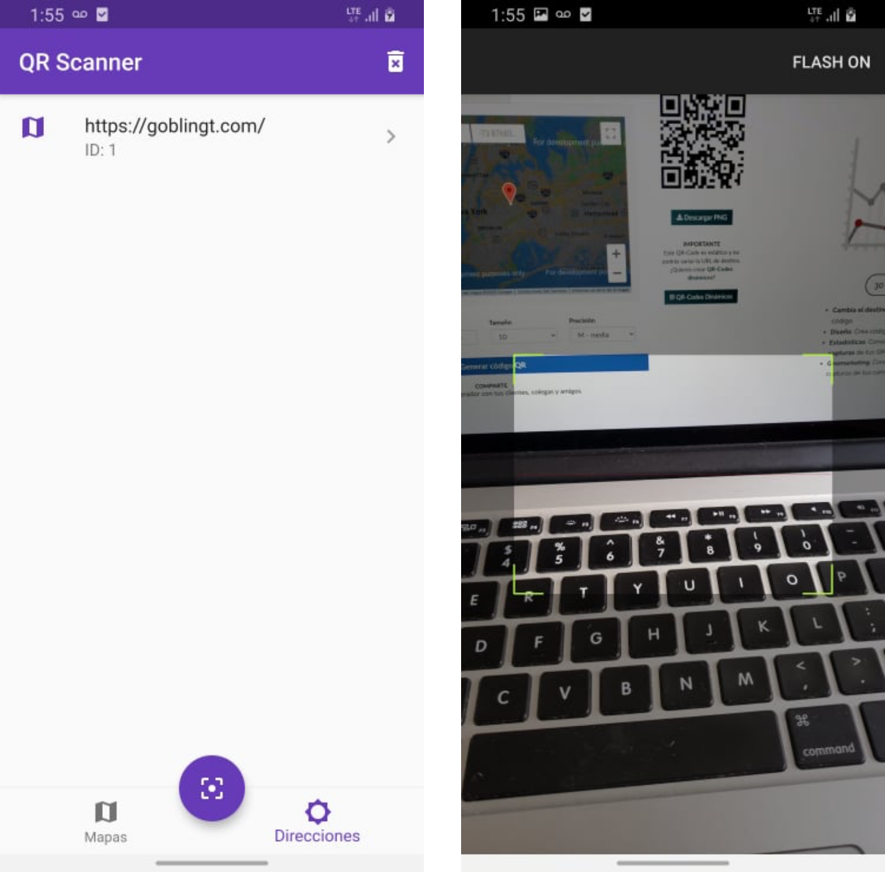

# QR Reader app

A flutter project to manage data on flutter and use some phone hardware like camera and use MAPBOX.
This is a practice excercise from Flutter: Tu guía completa de desarrollo para IOS y Android created by Fernando Herrrera

- Launch camera and Read QR codes.
- Use SQLite to manage data.
- SQLite CRUD
- Use of maps
- Mapbox
- Use markers on maps
- Open URLs from app




## Getting Started

```
flutter get packages
```
```
flutter run
```